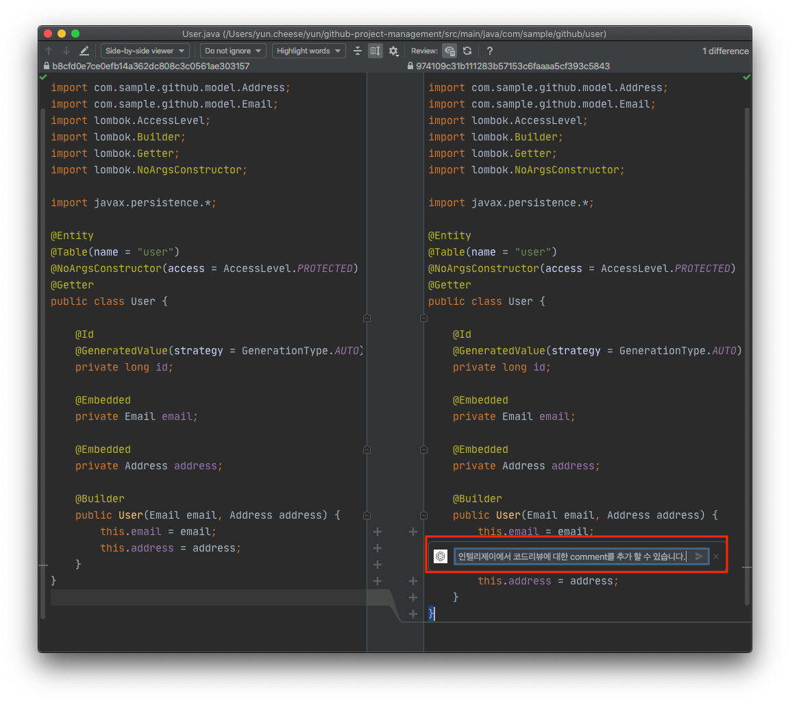
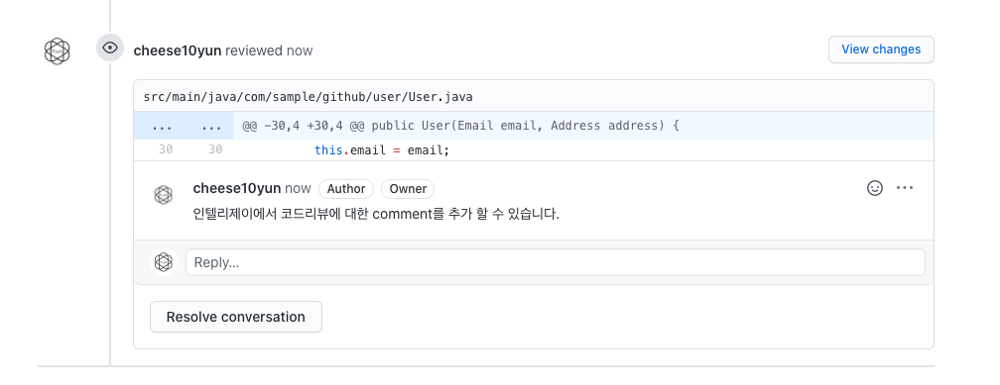
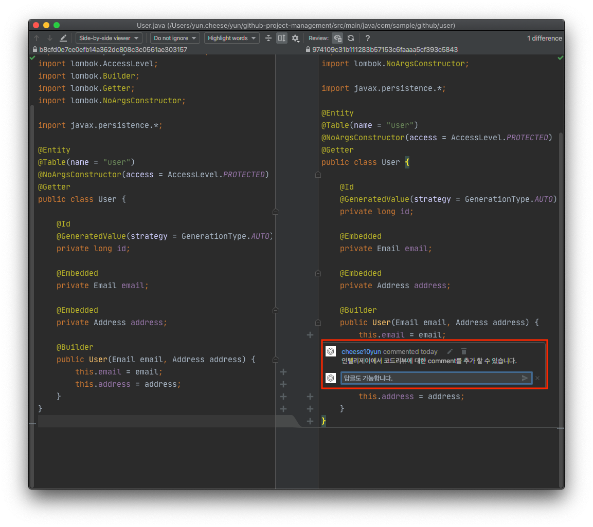
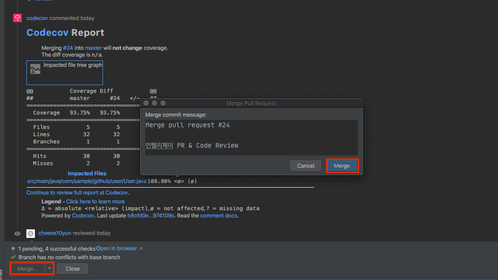
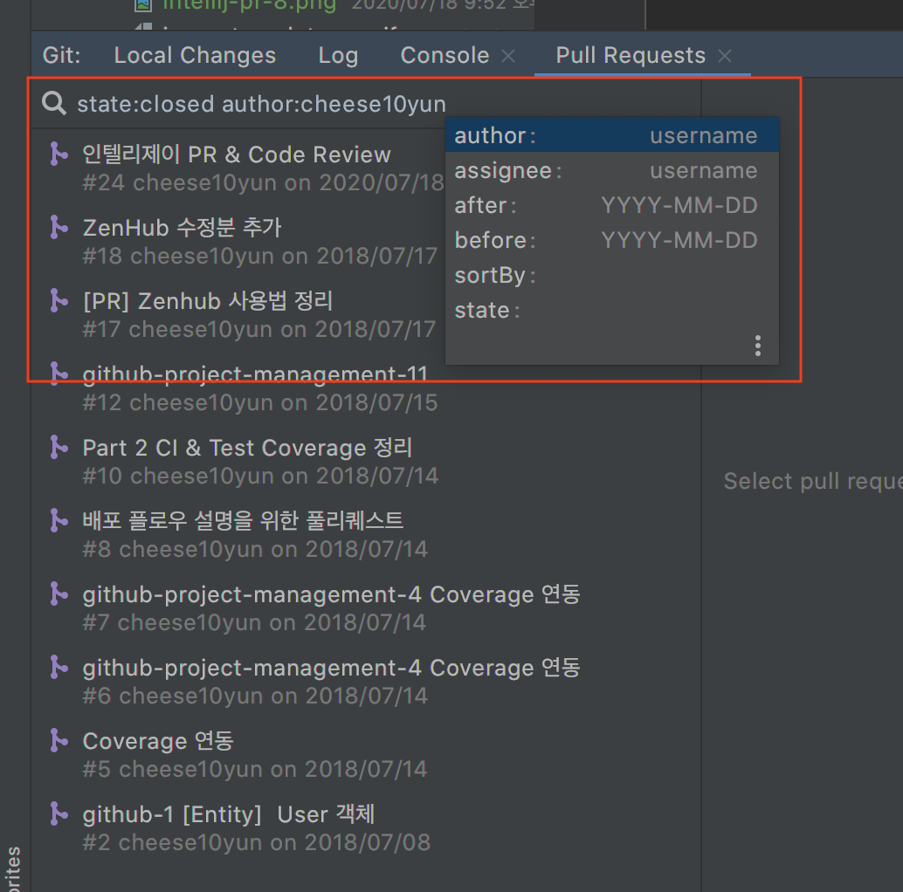

인텔리제이기반으로 Github 기반 Pull Request & Code Review를 진행할 수 있습니다. 바로 기능을 살펴보겠습니다. 인텔리제이 기반 Pull Request는 [Github로 프로젝트 관리하기 Part1](https://cheese10yun.github.io/github-proejct/#pull-requestcode-review-1)을 참고해 주세요

## Code Review

`Actions`에서 `View Pullrequests`을 통해서 현재 PR을 확인할 수 있습니다.

`state:open `을 통해서 현재 open 상태이 PR 리스트를 확인할 수 있고 우측에는 코드 리뷰 대상 파일이 있고 `User.java` 파일을 클릭해서 Diff를 확인할 수 있습니다.

해당 코드에 대해서 코멘트를 추가하고 싶은 경우 `+` 버튼을 클릭해서 코멘트를 달 수 있습니다.

이렇게 추가한 코멘트는 Github, Intellij에서도 확인할 수 있으며 코멘트에 대한 코멘트도 추가할 수 있습니다.

또 인텔리제이에서 머지도 가능합니다. `Merge` 버튼을 눌러서 머지를 진행합니다. [인텔리제이 PR & Code Review #24](https://github.com/cheese10yun/github-project-management/pull/24)는 실제 PR이 머지 된 것을 확인할 수 있습니다.

위처럼 질이를 통해서 PR에 `status`, `author`, `assignee`을 기반으로 검색을 할 수 있습니다.
 